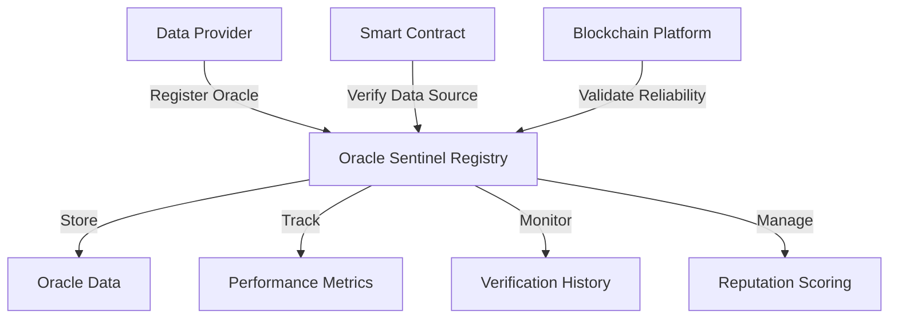

# Pioneering Oracle Sentinel

A decentralized infrastructure for registering, verifying, and tracking oracle data sources with high reliability and transparency.

## Overview

Pioneering Oracle Sentinel provides a robust, trustless system for managing and validating external data providers. It enables blockchain developers, data scientists, and smart contract architects to:

- Register and verify oracle data sources
- Track oracle performance and reliability
- Implement sophisticated data validation mechanisms
- Maintain comprehensive provenance records for data sources
- Enforce rigorous verification standards

## Architecture

The system is built around a central oracle sentinel registry contract that handles data provider registration, performance tracking, and verification mechanisms.



### Core Components
- Oracle Registry: Maintains core oracle data and verification status
- Performance Tracking: Stores detailed reliability and performance metrics
- Verification History: Monitors oracle interactions and data integrity
- Reputation Management: Dynamically assesses and scores data providers

## Contract Documentation

### Oracle Sentinel Registry Contract

The main contract managing oracle data source registration and verification.

#### Key Features
- Oracle data source registration with comprehensive metadata
- Performance tracking and reliability scoring
- Verification mechanism with rigorous validation standards
- Reputation management for data providers
- Flexible configuration for different verification requirements

#### Access Control
- Oracle registration restricted to verified providers
- Performance metrics management with strict permissions
- Dynamically adjustable verification parameters

## Getting Started

### Prerequisites
- Clarinet
- Stacks wallet
- STX tokens for transactions

### Basic Usage

1. **Register a new Oracle**
```clarity
(contract-call? .oracle-sentinel-registry register-oracle
    "https://data-source.com/endpoint"
    "Oracle Provider"
    "Blockchain Data Oracle"
    {categories: (list "Finance" "Weather")}
    u500 ;; Initial reputation score
    true ;; Is active
)
```

2. **Update Oracle Performance**
```clarity
(contract-call? .oracle-sentinel-registry update-oracle-performance 
    oracle-id 
    u95 ;; Performance score
    true ;; Verification passed
)
```

3. **Verify Oracle Reliability**
```clarity
(contract-call? .oracle-sentinel-registry verify-oracle-reliability oracle-id)
```

## Function Reference

### Public Functions

#### Oracle Management
- `register-oracle`: Register a new data source
- `update-oracle-metadata`: Modify oracle details
- `update-oracle-performance`: Track oracle performance
- `update-oracle-status`: Change oracle activation status

#### Verification
- `verify-oracle-reliability`: Perform oracle reliability check
- `update-verification-parameters`: Adjust verification standards

### Read-Only Functions
- `get-oracle-info`: Retrieve basic oracle information
- `get-oracle-performance`: Get performance metrics
- `get-oracle-verification-history`: Access verification records
- `check-oracle-status`: Verify current oracle status

## Development

### Testing
1. Clone the repository
2. Install Clarinet
3. Run tests:
```bash
clarinet test
```

### Local Development
1. Start Clarinet console:
```bash
clarinet console
```
2. Deploy contracts:
```clarity
(contract-call? .oracle-sentinel-registry ...)
```

## Security Considerations

### Limitations
- Transfer history limited to 10 most recent transfers
- Maximum royalty percentage of 50%
- Metadata string length restrictions

### Best Practices
- Verify asset ownership before integration
- Check transferability status before transactions
- Validate metadata URL authenticity
- Handle royalty distributions correctly
- Monitor transfer events for asset tracking